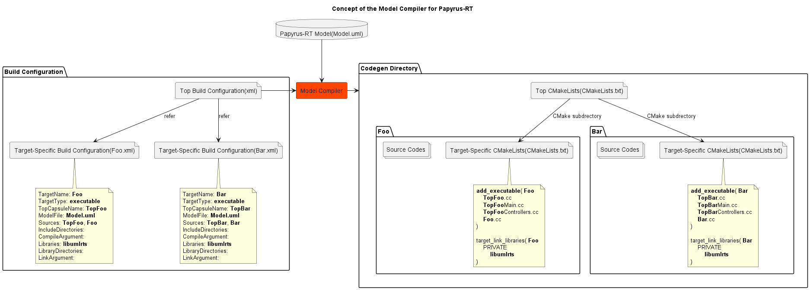

# Model Compiler for Papyrus-RT

## Introduction

**Model Compiler for Papyrus-RT** is a build tool for projects using Papyrus-RT.
It enables command-line code generation and works on various platforms.

The Model Compiler for Papyrus-RT supports **build configuration**.
It is text-based files which have codegen, build settings.
This feature makes settings can be stored in VCS repository such as Git together with model.



The Model Compiler for Papyrus-RT inputs model and the build configuration.
And it generates source codes and CMake build scripts.
(Codegen functionality uses Papyrus-RT's standalone code generator.)

This project has implementation of the Model Compiler for Papyrus-RT,
and sample project(you can build and run).

## Motivation

Papyrus for Real Time (Papyrus-RT) is a UMR-RT based software development tool.
User can do modeling and generate code with Papyrus-RT to develop software.
The latest(1.0.0) one does not support command-line code generation officially.
And unfortunately Papyrus-RT development seems to be not active.

I hope that there is command-line code generation feature on Papyrus-RT for development with CI tool such as Jenkins.

## Features

* Command-line code generation
* Build configuration support
* Platform-independent

## Prerequisites

#### Supported Platform

* Linux
* Windows(MSVC)

#### Required Software

* **Papyrus-RT**
* **Python 3** 3.6.8 or above
* **CMake** 3.17 or above
* And toolchain which can build C++ source code
    * **GNU Make** (Sample project depends it. The Model Compiler for Papyrus-RT itself does not depends.)

## How to Use

#### How to Try Sample Project

###### Step 1: Settings

Let's add paths so that the followings can be operated from command line.

* Papyrus-RT
* Python 3
* CMake
* GNU Make

Let's do settings so that C++ toolchain such as G++(Linux), CL(Windows)
can be operated from command line.

###### Step 2: Define required environment variable

|Item|Description|
|:---|:---|
|PAPYRUSRT_ROOT|Path to Papyrus-RT root. |
|UMLRTS_ROOT|Path to RTS library source directory.<br>Typical "[Papyrus-RT root]/plugins/org.eclipse.papyrusrt.rts_versionstring/umlrts/"|

###### Step 3: Open model

(You can skip this step if you are not interested in model.)  
Let's start Papyrus-RT with startup script named `papyrusrt.[sh|bat]`.
It makes sure that workspace directory exists before start of the application.

On Papyrus-RT, let's operation followings.

1. Click "File" menu
1. Select "Open Projects from File System..." (Wizard appears)
1. Select model directory on the wizard
1. Click "Finish" button on the wizard(The wizard disappears)
1. Double-click "Sample" on Project Explorer


###### Step 4: Build and run

Let's type following to build and run on project root directory.

```sh
make
./zzz_build/zzz_codegen/AliceAndBob/AliceAndBob
```


###### Misc: Explanation of AliceAndBob

AliceAndBob is one of executables in sample project and executed in step 4.
Capsules "Alice" and "Bob" send messages each other.
Sequence diagram of the AliceAndBob is below.


#### The Others

* [Sample project explanation](doc/user_guide/sample_project_explanation.md)
* [How to integrate the Model Compiler for Papyrus-RT into your project](doc/user_guide/how_to_integrate_the_model_compiler.md)

## Directory Structure

```
+---build_configuration             Build configuration of the sample project
+---doc                             Documents
+---model                           Model of the sample project
+---model_compiler_for_papyrusrt    Impelementation of the Model Compiler for Papyrus-RT
+---zzz_build                       [Temporary Directory]
|                                   Build directory of the sample project.
|                                   Deliverables such as executables, libraries are created here.
+---zzz_codegen                     [Temporary Directory]
|                                   Codegen directory of the sample project.
|                                   Codes and build scripts are generated here.
\---zzz_workspace                   [Temporary Directory]
                                    Papyrus-RT's workspace.
```

## License

Copyright 2023 [Hidekazu TAKAHASHI](https://github.com/Bacondish2023).
The Model Compiler for Papyrus-RT is free and open-source software licensed
under the **Eclipse Public License 1.0**.

This project includes following derived work.

 * **papyrusrt_codegen_wrapper.py** is derived from
   **umlrtgen.sh** which is available in the Papyrus-RT and licensed under the EPL 1.0.
