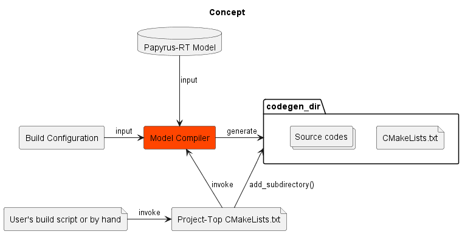

# Requirements

## Introduction

#### Background

Papyrus for Real Time (Papyrus-RT) is a UMR-RT based software development tool.
User can do modeling and generate code with Papyrus-RT to develop software.
Latest(1.0.0) Papyrus-RT does not support command-line code generation.
And unfortunately Papyrus-RT development seems to be not active.

I hope that there is command-line code generation feature on Papyrus-RT for development with CI tool such as Jenkins.
And that is an already existing idea and has been posted on the following Papyrus-RT forums.  
[Forums: Invoke code generator command line](https://www.eclipse.org/forums/index.php/t/1096554/)  
It is answered that Papyrus-RT can perform command-line code generation
with Papyrus-RT's standalone code generator and a shell script named umlrtgen.sh
which invokes the codes generator.
And it is not official feature.

I think the information is good.
But I think there is still room for improvement for me.  
The shell script needs command-line parameters such as top capsule name and path to model file.
I think it is more useful that the parameters are written on VCS controlled file as configuration
and code generation mechanism refers the configuration file at run.

And the code generation method depends Linux(or Cygwin) platform due to shell script.
I think it is more useful that code generation mechanism does not depend to specific platform.

Therefore, I hope to create a command-line code generation feature which have characteristics at least followings.

* Build configuration support
* Platform-independent

Misc:  
In [Eclipse Wiki: Papyrus-RT/Releases](https://wiki.eclipse.org/Papyrus-RT/Releases#Papyrus-RT_v1.0)  
"the build and transformation configurations" feature was planned to be implemented in 2017.
If the development had continued, the feature I want might have been implemented.

#### Scope

In scope

* Develop a tool "Model Compiler for Papyrus-RT" which reads build configuration and invokes Papyrus-RT standalone code generator.
* The "Model Compiler for Papyrus-RT" can be invoked by command-line
* Define data format of the build configuration

Out scope

* Develop code generator which generate source code from UML-RT model
* Adopt the "Model Compiler for Papyrus-RT" to Papyrus-RT GUI operation.

## Functional Requirements

#### [FR_1] Code Generation

Description:  
Source codes and are generated from UML-RT model.
And build scripts are generated.  
All operations can be done by command-line.

The build scripts is CMake.

###### [FR_1.1] Code Generation Based on Build Configuration

Description:  
User can specify at least following items on the build configuration.
And the build configuration is read at build process.

Rational:  
Fits to development which uses VCS.
Information for build can be controlled by VCS and can be committed into repository together with model.

###### [RF_1.2] Type of Build Deliverable

Description:  
Generated codes are built to be executable or library.
And user can specify type of deliverable with the build configuration.

Rational:  
Useful.

###### [RF_1.3] Multiple Build Deliverables

Description:  
Generated codes from one model can be build to be multiple executables and libraries.

Rational:  
Useful for multi-process project.

###### [RF_1.4] Update if required

Description:  
Build performed if outputs whose sources have changed.

Rational:  
Skip unnecessary step to save time.

######  [FR_1.5] Out-of-source codegen and build

Description:  
Source codes and build scripts are generated into a directory
which is different from source directory such as model directory.
And build deliverables are generated into a directory which is different from codegen directory.

Rational:  
Fits to development which uses VCS.

######  [FR_1.6] Multi-thread support

Description:  
User can assign RTS Controller(thread) to capsule instance with BuildConfiguration and implementation.

Rational:  
Useful.

####  [FR_2] Initialize codegen directory

Description:  
Create codegen directory and create empty CMakeLists.txt which is old in the codegen directory.

Rational:  
Codegen directory and its CMakeLists.txt are needed to exist before very-fist Project-top CMakeLists.txt's run due to CMake subdirectory.
And making CMakeLists.txt old is needed by FR_1.5.

## Interfaces

###### Model Compiler for Papyrus-RT

The Model Compiler for Papyrus-RT is invoked with command-line.
The tool expects invoked user's build script such as CMake or Makefile.

Mandatory Parameters

* Path to project-top Directory
    * For resolving relative path from project-top directory which is written in BuildConfiguration
* Path to codegen directory
* Path to BuildConfiguration

Optional Parameters

* Show help
* Loglevel

###### Codegen_dir

Codegen_dir is output directory for code generation.
And it expects integrated by Project-top CMakeLists.txt as CMake subdirectory.

## Non-Functional Requirements

######  [NFR_1] Portability

Be platform-independent.
The Model Compiler for Papyrus-RT will be implemented with Python 3.
And CMake is used for build script.

## System Requirements

Platform

* Linux
* Windows

Required software

* Papyrus-RT
* CMake
* Python 3
