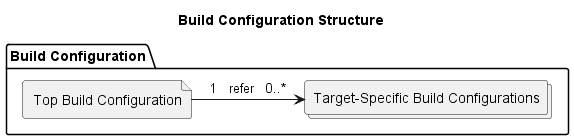
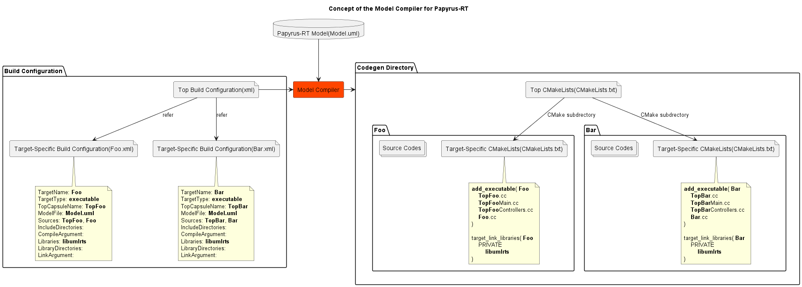
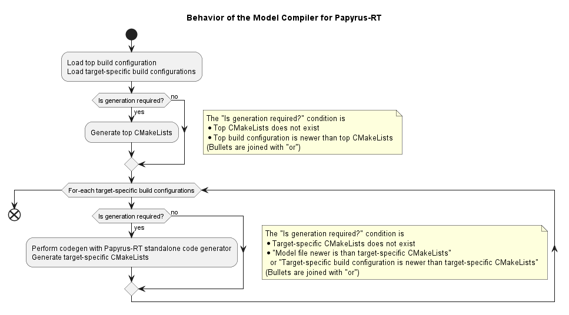
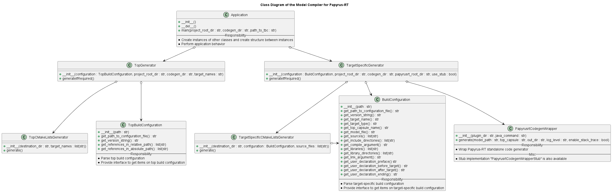

# High Level Design

## Build Configuration

The **build configuration** is XML files used for input to the Model Compiler.
It has items required for codegen and build [FR_1.1].



The build configuration is consist of 2 types of XML file, **top build configuration** and **target-specific build configuration**.
A build configuration can contain 1 top build configuration and 0..* of target-specific build configurations.
top build configuration has reference to each target-specific build configurations.
And target-specific build configuration has codegen, build information for specific target.
Structure that each target corresponds to target-specific build configuration enables multiple-deliverables feature [FR_1.3].


## Model Compiler for Papyrus-RT

The Model Compiler for Papyrus-RT inputs model and build configuration.
And it generates source codes and CMake build scripts.
All operations to Model Compiler for Papyrus-RT can be done by command-line [FR_1].

The Model Compiler for Papyrus-RT does not do code generation directly.
And internally, it invokes the PapyrusRT standalone code generator.

The Model Compiler for Papyrus-RT generates CMake build script for platform-independence.
And the Model Compiler for Papyrus-RT is implemented with Python for platform-independence
[NFR_1].



Source codes and build scripts are generated into codegen directory[FR_1.5].
Path of codegen directory is passed to the Model Compiler for Papyrus-RT
as command-line argument.
Target-specific subdirectories are generated under codegen directory.
And source codes and target-specific CMakeLists.txt are generated
into target-specific subdirectories.
With the structure which has target-specific subdirectories, the Model Compiler for Papyrus-RT supports multiple deliverables[FR_1.3].

Top CMakeLists is generated under the codegen directory.
And top CMakeLists links target-specific subdirectories with CMake's `add_subdirectory()`.

Top CMakeLists corresponds to top build configuration.
And each target-specific subdirectories correspond to target-specific build configuration.



The Model Compiler for Papyrus-RT updates outputs if required[RF_1.4].

The decision that update is required is done with output existence and timestamp.
Therefore, the Model Compiler for Papyrus-RT updates all deliverables
even if one element in model is update.
That is performance limitation.

#### Codegen Directory Arrangement

The Model Compiler for Papyrus-RT arranges target-specific subdirectories
after codegen with Papyrus-RT standalone code generator.  
The "arrange" means followings.

* Remove unnecessary source codes
* Remove unnecessary build scripts

Rational:  
Papyrus-RT standalone code generator generates source codes of all elements
in specified model.
And user can confuse which source code is necessary or not.
Therefore, The Model Compiler for Papyrus-RT removes unnecessary source codes.

And Papyrus-RT standalone code generator also generates build scripts
which is not based on target-specific build configuration.
These build scripts are also unnecessary.

Example:  
Assume that there is a model which has elements required for a deliverable "AliceAndBob".
And it also has not required elements like below.

* Model
    * Required for "AliceAndBob"
        * TopAliceAndBob
        * Alice
        * Bob
        * AliceAndBobProtocol
    * Not required for "AliceAndBob"
        * Foo
        * Bar

Papyrus-RT standalone code generator generates following files.

* TopAliceAndBobMain.cc
* TopAliceAndBobControllers.hh
* TopAliceAndBobControllers.cc
* TopAliceAndBob.hh
* TopAliceAndBob.cc
* Alice.hh
* Alice.cc
* Bob.hh
* Bob.cc
* AliceAndBobProtocol.hh
* AliceAndBobProtocol.cc
* **Foo.hh** <- unnecessary
* **Foo.cc** <- unnecessary
* **Bar.hh** <- unnecessary
* **Bar.cc** <- unnecessary
* **CMakeLists.txt** <- unnecessary
* **Makefile** <- unnecessary
* **MakefileTopAliceAndBob.mk** <- unnecessary
* TopAliceAndBob-connections.log

As you can see there are unnecessary files.

The Model Compiler for Papyrus-RT can know necessary source codes
because necessary elements are listed as **sources** on target-specific build configuration.
And The Model Compiler for Papyrus-RT can remove unnecessary files.

#### Controller Setting

User can assign RTS Controller(thread) to capsule instance
with build configuration and implementation[FR_1.6].

Papyrus-RT has controller assignment feature
and using the feature is thought to be a good way to achieve the requirements.  
The feature is explained in [Forums: Invoke code generator command line](https://www.eclipse.org/forums/index.php/t/1096554/).

```
Option b) means that any capsule instance can be executed in a separate thread.
More precisely, the thread will run a (RTS) controller, which will execute one or more capsule's behaviours.
A controller is the central element of the runtime system.
It runs in its own thread, and manages the life-cycle of a set of capsule instances.
It contains a queue of incoming messages (shared by all capsules managed by the controller).
It basically runs a loop where it gets the event from the incoming event queue with the highest priority, looks at the event's recipient (some capsule) and "gives it" to the capsule to process, which means executing a "run-to-completion" step on the capsule's state machine.
It is a "run-to-completion" step because the event will be fully processed by that recipient capsule state machine before the next event in the queue is processed by the controller.

Now, you can have more than one controller and you can assign capsule instances to different controllers, and therefore different threads. There are two ways of doing this:

1) Statically by specifying a "Top.controllers" file. This is a simple text file that you place next to the model and has a simple format consisting of lines of the form:

--- code
<capsule-part-qualified-name> = <controller-name>
---

Where the <controller-name> is given by you. Different controller names will result in spawning different threads. For example

--- code
Top.pinger = Controller1
Top.ponger = Controller2
---

```

And dynamic way is also explained

```
2) Dynamically by specifying a controller on the incarnate operation on an optional part.
In this case the container capsule must have a port of type "Frame", and in some action in the state machine you invoke the "incarnate" operation
on the Frame port providing a reference to the optional part where you are going to instantiate the capsule, and optionally a reference to some controller.
If no controller is specified, the capsule is incarnated in the same controller as the part's owner.

--- code
<frame-port>.incarnate(<part-name>)
---

or

--- code
<frame-port>.incarnate(<part-name>, <pointer-to-controller>)
---

These methods return a "UMLRTCapsuleId" that can be checked for validity, to ensure that the incarnation was successful.

So for example, suppose that "ponger" was an optional part and the Top capsule had a "frame" port of type Frame.
Then, you could incarnate ponger in some controller named, e.g. "PlayerController" by writing this in some action in Top's state machine:

--- code
UMLRTCapsuleId id = frame.incarnate(ponger, PlayerController);
if (!id.valid()) {
    // error
}
---

One catch is that this code will not compile alone if PlayerController doesn't refer to a (pointer to a) UMLRTController.
The code generator will create these pointers and controllers based on the names that appear on the Top.controllers file described above,
so even in this dynamic case, you would still need to provide the file,
but the incarnate operation would allow you to dynamically assign a controller to a part that has not been assigned one in the file.
```


So, Model Compiler for Ppapyrus-RT is required following operations.

1. Create a controllers file (name: [TopCapsuleName].controllers) on model directory
    1. Get **controllerSetting** whose format is the `<capsule-part-qualified-name> = <controller-name>` from target-specific build configuration.
    1. Write content of the **controllerSetting** into the file
1. Invoke Papyrus-RT standalone code generator

In generated code, controllers which are written on **controllerSetting** are defined and assigned to capsule instances statically.
And user can assign defined controllers to capsule instance in dynamic way with incarnate implementation.


## Codegen Directory Initialization

DummyCMakeListsGenerator is responsible for
creating dummy CMakeLists.txt which is empty and very old [FR_2].

Following module available.  
**model_compiler_for_papyrusrt.misc.dummy_cmakelists_generator**


# Low Level Design

## Build Configuration

#### Top Build Configuration

|Item|Description|Multiplicity|
|:---|:---|:---|
|topBuildConfiguration|Top level element|1|
|topBuildConfiguration/reference|Reference to target-specific build configuration|0..*|

Typical top build configuration is below.

```xml
<?xml version="1.0" encoding="UTF-8"?>
<topBuildConfiguration version="1.0">
    <reference relativePath="Foo.xml"/>
    <reference relativePath="Bar.xml"/>
</topBuildConfiguration>
```

And top CMakeLists like below is generated by Model Compiler for Papyrus-RT.

```
add_subdirectory(Foo)
add_subdirectory(Bar)
```

#### Target-Specific Build Configuration

The target-specific build configuration has codegen, build information for specific target.
The table below is design of data.


|Item|Description|Multiplicity|Mandatory?|Line break allowed?|CMake Variable Available?|
|:---|:---|:---|:---|:---|:---|
|buildConfiguration|Top level element|1|-|-|-|
|buildConfiguration/targetName|Target name which used for deliverable name|1|**Yes**|No|No|
|buildConfiguration/targetType|One of {"executable", "library"}|1|**Yes**|No|No|
|buildConfiguration/topCapsuleName|Same with item name|1|**Yes**|No|No|
|buildConfiguration/modelFile|Relative path to model file from project root directory|1|**Yes**|No|No|
|buildConfiguration/sources|(Parent element of source)|1|-|-|-|
|buildConfiguration/sources/source|Source element in model|1..*|**Yes**|No|No|
|buildConfiguration/controllerSetting|Contoller(thread) setting<br>Format: `<capsule-part-qualified-name> = <controller-name>`|1|No|**Yes**|No|
|buildConfiguration/includeDirectories|(Parent element of includeDirectory)|No|-|-|-|
|buildConfiguration/includeDirectories/includeDirectory|Same with item name|0..*|No|No|**Yes**|
|buildConfiguration/compileArgument|Same with item name|1|No|No|**Yes**|
|buildConfiguration/libraries|(Parent element of library)|1|-|-|-|
|buildConfiguration/libraries/library|Same with item name|0..*|No|No|**Yes**|
|buildConfiguration/libraryDirectories|(Parent element of libraryDirectory)|1|-|-|-|
|buildConfiguration/libraryDirectories/libraryDirectory|Same with item name|0..*|No|No|**Yes**|
|buildConfiguration/linkArgument|Same with item name|1|No|No|**Yes**|
|buildConfiguration/userDeclarationPreface|User declaration inserted at preface of build script|1|No|**Yes**|**Yes**|
|buildConfiguration/userDeclarationBeforeTarget|User declaration inserted at right before target declaration<br>such as add_executable()|1|No|**Yes**|**Yes**|
|buildConfiguration/userDeclarationAfterTarget|User declaration inserted at right after target declaration<br>such as add_executable()|1|No|**Yes**|**Yes**|
|buildConfiguration/userDeclarationEnding|User declaration inserted at ending of build script|1|No|**Yes**|**Yes**|

Target-specific build configuration has **TargetType** which specifies executable or library [FR_1.2].

**Mandatory?**  
User need to write content on items whose value is "Yes".
Example `<tag>content</tag>`  
User can define empty item(element) whose value is "No".
Example `<tag/>`, `<tag></tag>`  

**Line break allowed?**  
User can write multi-line value on items whose value is "Yes".

**CMake Variable Available?**  
User can use CMake variables on items whose value is "Yes".
For exmaple, user can specify include directory which is under project root directory
with writing includeDirectories with "${PROJECT_SOURCE_DIR}/include".

Typical target-specific build configuration is below.

```xml
<?xml version="1.0" encoding="UTF-8"?>
<buildConfiguration version="1.0">
    <targetName>AliceAndBob</targetName>
    <targetType>executable</targetType>
    <topCapsuleName>TopAliceAndBob</topCapsuleName>
    <modelFile>model/Example.uml</modelFile>
    <sources>
        <source>TopAliceAndBob</source>
        <source>Alice</source>
        <source>Bob</source>
        <source>AliceAndBobProtocol</source>
    </sources>
    <controllerSetting/>
    <includeDirectories>
        <includeDirectory>src</includeDirectory>
    </includeDirectories>
    <compileArgument>-DNEED_NON_FLEXIBLE_ARRAY</compileArgument>
    <libraries>
        <library>libumlrts</library>
    </libraries>
    <libraryDirectories>
        <libraryDirectory>src</libraryDirectory>
    </libraryDirectories>
    <linkArgument/>
    <userDeclarationPreface/>
    <userDeclarationBeforeTarget/>
    <userDeclarationAfterTarget/>
    <userDeclarationEnding>
if (MSVC)
    target_link_libraries(
        AliceAndBob
        PRIVATE
            ws2_32.lib
    )
endif ()
</userDeclarationEnding>
</buildConfiguration>
```

And target-specific CMakeLists like below is generated by Model Compiler for Papyrus-RT.

```
add_executable( AliceAndBob
    src/TopAliceAndBobMain.cc
    src/TopAliceAndBobControllers.cc
    src/TopAliceAndBob.cc
    src/Alice.cc
    src/Bob.cc
    src/AliceAndBobProtocol.cc
)

target_include_directories( AliceAndBob
    PUBLIC
        src
)

target_compile_options( AliceAndBob
    PRIVATE
        -DNEED_NON_FLEXIBLE_ARRAY
)

target_link_libraries( AliceAndBob
    PRIVATE
        libumlrts
)

if (MSVC)
    target_link_libraries(
        AliceAndBob
        PRIVATE
            ws2_32.lib
    )
endif ()
```


## Model Compiler for Papyrus-RT

#### Structure



#### Limitation of "library" TargetType

"library" TargetType has some limitations unlike "executable".

* "library" TargetType deliverables cannot contain capsule.
* "library" TargetType deliverables require top capsule
  on target-specific build configuration and the specified top capsule will be not used at all.

Rational:  
Avoid collision main function and global variables
between "executable" TargetType deliverables and "library" TargetType deliverables.

Example:  
"library" TargetType deliverables are expected to linked into "executable" TargetType deliverable.

Assume that there is a model which has elements for "AliceAndBob" like below.

* Model
    * TopAliceAndBob
    * Alice
    * Bob
    * AliceAndBobProtocol

Papyrus-RT standalone code generator generates following source codes.

* **TopAliceAndBobMain.cc** <- has main function
* TopAliceAndBobControllers.hh
* **TopAliceAndBobControllers.cc** <- has globally defined "DefaultController" variable
* TopAliceAndBob.hh
* TopAliceAndBob.cc
* Alice.hh
* Alice.cc
* Bob.hh
* Bob.cc
* AliceAndBobProtocol.hh
* AliceAndBobProtocol.cc

**TopAliceAndBobMain.cc** has main function
and **TopAliceAndBobControllers.cc** has globally defined "DefaultController" variable.
These will collide with "executable" TargetType deliverable's.

Next, consider what happens when **TopAliceAndBobMain.cc**, **TopAliceAndBobControllers.hh** and **TopAliceAndBobControllers.cc** are excluded.
There is controller definition on TopAliceAndBobControllers.cc.
So, capsules are not drived without TopAliceAndBobControllers.cc.

"library" TargetType deliverables cannot contain capsules.
On the other hand, Papyrus-RT standalone code generator requires top capsule for codegen.

Conclusion:  
* "library" TargetType deliverables require top capsule
  on target-specific build configuration and the specified top capsule will be not used at all.
* And deliverables whose TargetType is "library" can contains following elements.
    * PassiveClasses
    * Structures
    * Typedefs
    * Enumerations
    * Protocols
