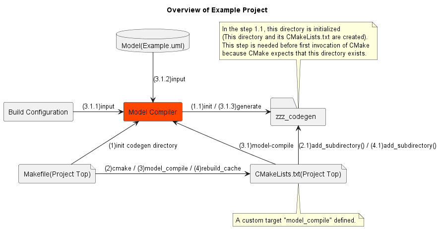

# How to Integrate the Model Compiler for Papyrus-RT into Your Project

In this document, let's learn about integration using exmaple project as an exmaple.

## Overview

Let's see a diagram below.
It is overview of exmaple project on this repository about model-compile
which includes codegen and build script generation.
Compile and link(ordinary build) are not included in the diagram.

Arrows mean invocation or data flow.
And leading numbers on arrow mean order of happen.
(1)->(1.1)->(2)->(2.1) ...



This repository integrates the Model Compiler for Papyrus-RT
using 2 build scripts, **Makefile(Project Top)** and **CMakeLists.txt(Project Top)**.
It is helpful learning what these build scripts does.


**Makefile(Project Top)** is user interface of build mechanism.
User types something, the Makefile handles inputs first.
And the Makefile has responsible for order handling such as followings

* Initialize codegen directory(zzz_codegen) before invocation of CMake.
* Model_compile before rebuild_cache(CMake invocation)
* rebuild_cache before compile and link(ordinary build)

Corresponding implementation is below.

```makefile
.PHONY: all
all: $(BUILD_DIR)
	$(CD) $(BUILD_DIR) $(MAKE) model_compile
	$(CD) $(BUILD_DIR) $(MAKE) rebuild_cache
#	$(CD) $(BUILD_DIR) $(MAKE) --jobs -O
	$(CD) $(BUILD_DIR) $(MAKE)

$(BUILD_DIR): $(CODEGEN_DIR)
	$(MKDIR) $(BUILD_DIR)
	$(CD) $(BUILD_DIR) cmake -DCMAKE_BUILD_TYPE="Release" -G "Unix Makefiles" ..

$(CODEGEN_DIR):
	$(MKDIR) $(CODEGEN_DIR)
	python -B model_compiler_for_papyrusrt/model_compiler_for_papyrusrt/misc/dummy_cmakelists_generator.py $(CODEGEN_DIR)
```

**CMakeLists.txt(Project Top)** is responsible for followings

* Build settings over the exmaple project
* Custom targets definition: User can define targets which is outside of model
    * In exmaple project, target of Runtime Service(RTS) library defined using libumlrts.cmake
* Model-compile target definition which invokes the Model Compiler for Papyrus-RT
* `add_subdirectory()` to codegen directory

So far, brief explanation about overview is done.
If you need detailed information, see implementation of build scripts.

Succeeding sections explains some key points.


## Install the Model Compiler for Papyrus-RT

Installation is recommended for the Model Compiler for Papyrus-RT integration
into project outside of this repository.
Because installed one can be invoked independently against current directory.
(You don't have to install for trying exmaple project on this repository.)

Let's type following to install.

```sh
cd [root of this project]/model_compiler_for_papyrusrt/
python setup.py install
```

Let's type following to check installation.

```sh
python -m model_compiler_for_papyrusrt --help
```

If manual is displayed, installation is succeed.

The following is available commands after installation.
Commands are written without any parameters.
Commands with `--help` option show usage and help you.

|Item|Command|
|:---|:---|
|Model-compile|python -m model_compiler_for_papyrusrt|
|Create dummy CMakeLists.txt<br>(Initialization of codegen directory)|python -m model_compiler_for_papyrusrt.misc.dummy_cmakelists_generator|

## Build Configuration

The build configuration is XML files used for input to the Model Compiler for Papyrus-RT.
And it has items required for codegen and build.  
The build configuration is consist of 2 types of XML file,
**top build configuration** and **target-specific build configuration**.
In model compile(codegen), some CMake scripts(CMakeLists.txt) are generated based on the build configuration.  
If you need more information, see [design document](../development/20_design/design.md).

First, let's create a top build configuration and an empty target-specific build configuration.

Top build configuration(top.xml)
```xml
<?xml version="1.0" encoding="UTF-8"?>
<topBuildConfiguration version="1.0">
    <reference relativePath="AliceAndBob.xml"/>
</topBuildConfiguration>
```

Empty target-specific build configuration(AliceAndBob.xml)
```xml
<?xml version="1.0" encoding="UTF-8"?>
<buildConfiguration version="1.0">
    <targetName/>
    <targetType/>
    <topCapsuleName/>
    <modelFile/>
    <sources/>
    <controllerSetting/>
    <includeDirectories/>
    <compileArgument/>
    <libraries/>
    <libraryDirectories/>
    <linkArgument/>
    <userDeclarationPreface/>
    <userDeclarationBeforeTarget/>
    <userDeclarationAfterTarget/>
    <userDeclarationEnding/>
</buildConfiguration>
```

Let's fill the target-specific build configuration using AliceAndBob project as an example.
(AliceAndBob is exmaple project on this repository)

targetName is **AliceAndBob**  
targetType is **executable**  

modelFile is path to model file from project top directory.
Assume it is **model/Example.uml**

AliceAndBob project has following elements.
These elements are needed to be listed as sources/source

* **TopAliceAndBob** capsule
* **Alice** capsule
* **Bob** capsule
* **AliceAndBobProtocol** protocol

topCapsuleName is **TopAliceAndBob**

Target-specific build configuration will be following

```xml
<?xml version="1.0" encoding="UTF-8"?>
<buildConfiguration version="1.0">
    <targetName>AliceAndBob</targetName>
    <targetType>executable</targetType>
    <topCapsuleName>TopAliceAndBob</topCapsuleName>
    <modelFile>model/Example.uml</modelFile>
    <sources>
        <source>TopAliceAndBob</source>
        <source>Alice</source>
        <source>Bob</source>
        <source>AliceAndBobProtocol</source>
    </sources>
    <controllerSetting/>
    <includeDirectories/>
    <compileArgument/>
    <libraries/>
    <libraryDirectories/>
    <linkArgument/>
    <userDeclarationPreface/>
    <userDeclarationBeforeTarget/>
    <userDeclarationAfterTarget/>
    <userDeclarationEnding/>
</buildConfiguration>
```

Let's continue.

compileArgument is **-DNEED_NON_FLEXIBLE_ARRAY** .
Otherwise you will get compile error `error C2466: cannot allocate an array of constant size 0`
on MSVC environment against following generated code.

AliceAndBobProtocol.cc

```
static UMLRTObject_field fields_hello[] =
{
    #ifdef NEED_NON_FLEXIBLE_ARRAY
    {
        0,
        0,
        0,
        0,
        0
    }
    #endif
};
```

libraries/library is on what name of RTS library you use.
In this project, it is **libumlrts** because this peoject uses libumlrts.cmake which defines libumlrts library.
And libumlrts.cmake propagates library directory with CMake's mechanism.
So, you don't have to write libraryDirectories/libraryDirectory for libumlrts.  
Unless you use libumlrts.cmake, you need to find and write appropreate library name and library directory.

AliceAndBob requires different libraries on different platforms.
In Unix-like platform, AliceAndBob requires `pthread`.
In Windows(MSVC), AliceAndBob requires `ws2_32.lib`.
And the build configuration can address this requirements with userDeclarationEnding.
userDeclarationEnding is one of userDeclarations which can contain CMake code to be inserted into generated CMakeLists.txt

userDeclarationEnding is following code which switches library based on platform.

```
if (UNIX)
    target_link_libraries(
        AliceAndBob
        PRIVATE
            pthread
    )
elseif (MSVC)
    target_link_libraries(
        AliceAndBob
        PRIVATE
            ws2_32.lib
    )
endif ()
```

And the code will be inserted into end of generated CMakeLists.txt.

userDeclarationAfterTarget is also available for this situation
because `target_link_libraries(AliceAndBob some_libraries)` is enough
to be placed after target declaration(AliceAndBob).

Finished target-specific build configuration will be following.

```xml
<?xml version="1.0" encoding="UTF-8"?>
<buildConfiguration version="1.0">
    <targetName>AliceAndBob</targetName>
    <targetType>executable</targetType>
    <topCapsuleName>TopAliceAndBob</topCapsuleName>
    <modelFile>model/Example.uml</modelFile>
    <sources>
        <source>TopAliceAndBob</source>
        <source>Alice</source>
        <source>Bob</source>
        <source>AliceAndBobProtocol</source>
    </sources>
    <controllerSetting/>
    <includeDirectories>
        <includeDirectory>src</includeDirectory>
    </includeDirectories>
    <compileArgument>-DNEED_NON_FLEXIBLE_ARRAY</compileArgument>
    <libraries>
        <library>libumlrts</library>
    </libraries>
    <libraryDirectories/>
    <linkArgument/>
    <userDeclarationPreface/>
    <userDeclarationBeforeTarget/>
    <userDeclarationAfterTarget/>
    <userDeclarationEnding>
if (UNIX)
    target_link_libraries(
        AliceAndBob
        PRIVATE
            pthread
    )
elseif (MSVC)
    target_link_libraries(
        AliceAndBob
        PRIVATE
            ws2_32.lib
    )
endif ()
</userDeclarationEnding>
</buildConfiguration>
```

## Initialization of Codegen Directory

Initialization of codegen directory(zzz_codegen) is required **before** invocation of CMake.
Because CMake expects that subdirectory and its CMakeLists.txt exist.  

And you also need to make timestamp of CMakeLists.txt old **before** model-compile.
Because the Model Compiler for Papyrus-RT updates output only if its input is newer than output.

You can use the following command.
It creates empty and very old CMakeLists.txt under specified directory.

```sh
python -m model_compiler_for_papyrusrt.misc.dummy_cmakelists_generator codegen_dir
```

## Model-compile

Following is typical command for model compile.

```sh
python -m model_compiler_for_papyrusrt project_root_dir codegen_dir path_to_top_build_configuration
```

The Model Compiler for Papyrus-RT requires 3 mandatory options.

* project_root_dir
* codegen_dir
* top_build_configuration

If codegen directory is integrated into your CMake script as subdirectory,
you need to execute CMake's **rebuild_cache** after model compile.
