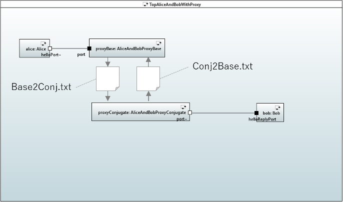

# Sample Project Explanation

## AliceAndBob

This is explained on top-level README.md.


## AliceAndBobWithProxy

Alice and Bob send messages through proxies.
The proxies transfer messages with file which is one of inter-process communication method.
(In this sample project, there is no pros because all capsule instances run on same process.)

The following is a composite structure diagram(drawing of files is added with image editor).



As you can see, there are 2 files "Base2Conj.txt" and "Conj2Base.txt".
Each file has each direction of messages.


## AliceAndBobWithThreads

Capsule instances run on different controllers(threads).

* TopAliceAndBob capsule instance runs on "MainThread"
* Alice capsule instance runs on "AliceThread"
* Bob capsule instance runs on "BobThread"


Corresponding settings on target-specific build configuration is below.

```xml
<controllerSetting>
TopAliceAndBob = MainThread
TopAliceAndBob.alice = AliceThread
TopAliceAndBob.bob = BobThread
</controllerSetting>
```
